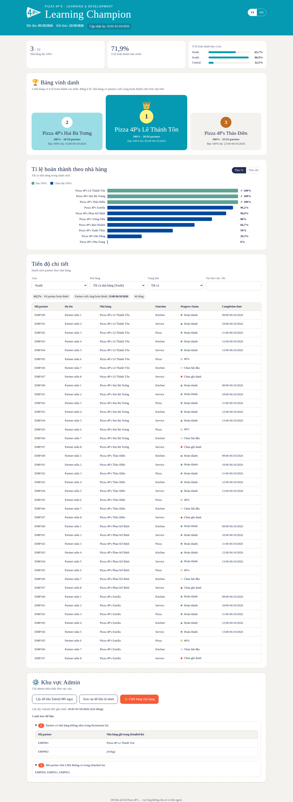

# 🏆 Learning Champion Dashboard — Hướng dẫn cài đặt

Live link hiển thị bảng xếp hạng nhà hàng cho chiến dịch **Learning Champion**, chạy bằng **Google Apps Script** (miễn phí, chỉ tài khoản @pizza4ps.com xem được).



> Ảnh trên dùng **dữ liệu giả** để minh họa.

---

## Mục lục
- [Tổng quan: hệ thống hoạt động thế nào](#tổng-quan)
- [Bước 0 — Chuẩn bị Google Sheet](#bước-0--chuẩn-bị-google-sheet)
- [Bước 1 — Mở Apps Script](#bước-1--mở-apps-script)
- [Bước 2 — Dán code vào 4 file](#bước-2--dán-code-vào-4-file)
- [Bước 3 — Chỉnh múi giờ dự án](#bước-3--chỉnh-múi-giờ-dự-án)
- [Bước 4 — Chạy "Thiết lập ban đầu" & cấp quyền](#bước-4--chạy-thiết-lập-ban-đầu--cấp-quyền)
- [Bước 5 — Kiểm tra sheet Config](#bước-5--kiểm-tra-sheet-config)
- [Bước 6 — Lưu TalentLMS API key](#bước-6--lưu-talentlms-api-key)
- [Bước 7 — Kiểm tra kết nối TalentLMS](#bước-7--kiểm-tra-kết-nối-talentlms)
- [Bước 8 — Bật lịch tự động 6h sáng](#bước-8--bật-lịch-tự-động-6h-sáng)
- [Bước 9 — Lấy dữ liệu lần đầu](#bước-9--lấy-dữ-liệu-lần-đầu)
- [Bước 10 — Tạo live link (Deploy)](#bước-10--tạo-live-link-deploy)
- [Bước 11 — Kiểm tra link & gửi cho mọi người](#bước-11--kiểm-tra-link--gửi-cho-mọi-người)
- [Vận hành hằng ngày](#vận-hành-hằng-ngày)
- [Khi cần sửa code: cập nhật link mà KHÔNG đổi URL](#khi-cần-sửa-code)
- [Tháng 11: chạy nhiều khóa](#tháng-11-chạy-nhiều-khóa)
- [Luật tính điểm (tóm tắt)](#luật-tính-điểm)
- [Xử lý sự cố](#xử-lý-sự-cố)

---

## Tổng quan

```
TalentLMS ──(6h sáng mỗi ngày)──► sheet "LMS Learning Progress"
                                         │
 "Detailed list" + "Restaurant list" ────┤  tính toán
                                         ▼
                             Dashboard (live link)
```

- Mỗi sáng ~6:00–7:00, script tự lấy dữ liệu TalentLMS về sheet, rồi tính lại bảng xếp hạng.
- Live link chỉ đọc kết quả đã tính sẵn → **50+ người mở cùng lúc vẫn nhanh**.
- Khi bạn bấm **Chốt**, dashboard đứng yên cho tới khi bạn bấm **Sync lại** hoặc **Mở chốt**.

**Ai thấy gì trên link:**

| Người xem | Ô KPI (theo Area) | Bảng vinh danh + Biểu đồ (%) | Số partner hoàn thành/tổng | Bảng chi tiết | Khu vực Admin |
|---|---|---|---|---|---|
| Mọi tài khoản @pizza4ps.com | ❌ | ✅ | ❌ | ❌ | ❌ |
| Restaurant Manager | ❌ | ✅ | ❌ | ✅ chỉ nhà hàng của mình | ❌ |
| Email trong sheet "Manager list" | ✅ | ✅ | ❌ | ✅ tất cả, lọc theo Area | ❌ |
| Admin (chủ script + email trong Config) | ✅ | ✅ | ✅ | ✅ tất cả | ✅ |

---

## Bước 0 — Chuẩn bị Google Sheet

Mở file Google Sheet của bạn và kiểm tra **tên sheet (tab ở dưới cùng)** và **tên cột (dòng 1)** đúng như sau. Viết hoa/thường không quan trọng, nhưng **chính tả phải đúng**.

**Sheet `Detailed list`** — bắt buộc có các cột:
- `EmployeeCode`, `EmployeeName`, `Restaurant`, `Function`
- (Các cột khác như Email, Job Band, Designation để nguyên, không ảnh hưởng)

**Sheet `Restaurant list`** — các cột:
- `Restaurant` — tên phải **giống hệt** cột Restaurant ở Detailed list
- `Store Code`
- **Cột D = Area** (North / South / Central) — script đọc theo **vị trí cột D**, tên tiêu đề cột không quan trọng
- `Restaurant Manager Email` — nếu 1 nhà hàng có 2 RM, ghi cả 2 email trong **cùng 1 ô**, cách nhau bằng dấu phẩy. Ví dụ: `rm1@pizza4ps.com, rm2@pizza4ps.com`

**Sheet `Manager list`** — ghi email người được xem chi tiết tất cả nhà hàng vào cột **A, B hoặc C** (mỗi ô 1 email, dòng tiêu đề không sao).

**Sheet `LMS Learning Progress`**
> ⚠️ Script sẽ **xóa và ghi đè toàn bộ** sheet này mỗi sáng. Nếu đang có dữ liệu quan trọng trong đó, hãy sao lưu trước (chuột phải vào tab → **Duplicate**).

Sau khi chạy, sheet này có 6 cột: `EmployeeCode | EmployeeName | Progress Status | Completion Date | Course | Course ID`.

---

## Bước 1 — Mở Apps Script

1. Mở Google Sheet.
2. Trên thanh menu, bấm **Extensions** (Tiện ích mở rộng) → **Apps Script**.
3. Một tab mới mở ra — đây là trình soạn code. Góc trên bên trái có chữ **Untitled project**: bấm vào và đổi tên thành `Learning Champion Dashboard` → **Rename**.

Ở cột bên trái, mục **Files**, bạn thấy sẵn 1 file tên `Code.gs`.

---

## Bước 2 — Dán code vào 4 file

Code nằm trên GitHub, thư mục `apps-script/`:
https://github.com/binhnguyen-grace/skill-development-tracking/tree/claude/pensive-goodall-41rmuj/apps-script

**Cách copy nội dung 1 file từ GitHub:** bấm vào tên file → ở góc phải phía trên khung code, bấm biểu tượng **Copy raw file** (hình 2 ô vuông chồng nhau) → nội dung đã nằm trong bộ nhớ tạm.

### 2a. File `Code.gs`
1. Trên GitHub, mở `Code.gs` → **Copy raw file**.
2. Quay lại Apps Script, bấm vào `Code.gs` ở cột trái.
3. Bấm vào khung code → **Ctrl + A** (Mac: Cmd + A) để chọn hết đoạn có sẵn → **Ctrl + V** để dán đè.

### 2b. File `Index.html`
1. Ở cột trái, cạnh chữ **Files**, bấm dấu **＋** → chọn **HTML**.
2. Gõ tên: `Index` (**chỉ gõ Index**, Apps Script tự thêm `.html`) → Enter.
3. Xóa hết nội dung mẫu (Ctrl + A → Delete).
4. Trên GitHub mở `Index.html` → **Copy raw file** → quay lại dán vào.

### 2c. File `Logos.html`
Làm giống 2b, đặt tên `Logos`, dán nội dung file `Logos.html` (file này là 1 đoạn chữ rất dài — đó là hình logo đã mã hóa, bình thường).

### 2c-2. File `Fonts.html`
Làm giống 2b, đặt tên `Fonts`, dán nội dung file `Fonts.html`. (File này giữ chỗ cho font thương hiệu — khi có file font, chỉ cần dán đè nội dung mới.)

### 2d. Lưu
Bấm biểu tượng **💾 Save project** (hoặc Ctrl + S).

✅ Kết quả: cột Files có đúng 4 file `Code.gs`, `Index.html`, `Logos.html`, `Fonts.html`. **Tên phải chính xác** (chữ I và L viết hoa).

---

## Bước 3 — Chỉnh múi giờ dự án

1. Cột ngoài cùng bên trái, bấm biểu tượng **⚙️ Project Settings**.
2. Mục **Time zone** → chọn **(GMT+07:00) Ho Chi Minh** (hoặc Bangkok / Jakarta cũng là GMT+7).

---

## Bước 4 — Chạy "Thiết lập ban đầu" & cấp quyền

1. Quay lại tab **Google Sheet**, bấm **F5** để tải lại trang.
2. Đợi vài giây, trên thanh menu xuất hiện menu mới **🏆 Learning Champion** (nằm sau Help).
3. Bấm **🏆 Learning Champion → 1. Thiết lập ban đầu**.
4. Lần đầu Google sẽ hỏi quyền:
   - Hộp **Authorization required** → bấm **OK / Continue**.
   - Chọn tài khoản **@pizza4ps.com** của bạn.
   - Nếu thấy màn hình **"Google hasn't verified this app"**: bấm **Advanced** → **Go to Learning Champion Dashboard (unsafe)**. (Đây là script của chính bạn, Google chỉ cảnh báo vì chưa qua kiểm duyệt công khai.)
   - Màn hình liệt kê quyền → bấm **Allow**.
   - Nếu công ty chặn không cho cấp quyền → xem mục [Xử lý sự cố](#xử-lý-sự-cố).
5. Bấm lại **1. Thiết lập ban đầu** một lần nữa (lần đầu chỉ để cấp quyền). Khi thấy thông báo *"Đã thiết lập xong"* là thành công.

Script vừa tạo: sheet `Config`, tiêu đề cho `LMS Learning Progress`, sheet `Manager list` (nếu chưa có) và 1 sheet ẩn `_Snapshot` (**đừng xóa sheet ẩn này**).

---

## Bước 5 — Kiểm tra sheet Config

Mở tab **Config**. Cột A là tên cài đặt, **chỉ sửa cột B**:

| Key | Giá trị mặc định | Ý nghĩa |
|---|---|---|
| Campaign Name | Learning Champion | Tiêu đề trên dashboard |
| Campaign Start | 05/10/2026 | Ngày bắt đầu (hiển thị) |
| Expected End | 23/10/2026 | Ngày dự kiến chốt (chỉ hiển thị — chốt thật bằng nút Chốt) |
| Course IDs | 689 | Mã khóa học TalentLMS. Nhiều khóa: `689, 701` |
| TalentLMS Domain | pizza4ps.talentlms.com | Tên miền TalentLMS |
| Employee Code Field | PZ Code | Tên custom field chứa mã NV. Không có thì dùng Username |
| Admin Emails | *(trống)* | Thêm admin khác, cách nhau dấu phẩy. Bạn luôn là admin |

---

## Bước 6 — Lưu TalentLMS API key

1. Menu **🏆 Learning Champion → 2. Lưu TalentLMS API key**.
2. Dán API key vào ô → **OK**.

🔒 Key được lưu trong vùng bảo mật của script (Script Properties), **không nằm trong sheet**, người xem sheet không thấy. **Không gửi key qua chat/email.**

> Lấy API key trên TalentLMS: đăng nhập admin → **Account & Settings** → tab **Security** → tích **Enable API** → copy **API Key**.

---

## Bước 7 — Kiểm tra kết nối TalentLMS

Menu **🏆 → 3. Kiểm tra kết nối TalentLMS**. Kết quả đúng sẽ như:

```
Kết nối thành công tới pizza4ps.talentlms.com
Custom field "PZ Code": tìm thấy (custom_field_3)
Khóa 689: "Tên khóa học" — 350 học viên
```

- Nếu báo *KHÔNG tìm thấy PZ Code* → kiểm tra tên field trên TalentLMS (mục **Custom user fields** trong Account & Settings) và sửa ô `Employee Code Field` trong Config cho khớp. Nếu để vậy, script dùng Username.

---

## Bước 8 — Bật lịch tự động 6h sáng

Menu **🏆 → 4. Bật lịch tự động 6h sáng**. Thông báo *"Đã bật lịch"* là xong.

> Google chạy trong khung **6:00–7:00** (không chính xác từng phút). Chỉ cần bấm **1 lần**; bấm lại cũng không tạo trùng.

---

## Bước 9 — Lấy dữ liệu lần đầu

Menu **🏆 → Lấy dữ liệu TalentLMS ngay**. Góc dưới phải hiện *"Đã lấy N dòng từ TalentLMS…"*.

Mở sheet **LMS Learning Progress** kiểm tra: cột EmployeeCode có đúng mã NV (khớp với Detailed list) không.

> Trước 05/10 khóa chưa mở nên có thể chưa có dữ liệu — vẫn bình thường.

---

## Bước 10 — Tạo live link (Deploy)

1. Quay lại tab **Apps Script**.
2. Góc trên bên phải, bấm nút xanh **Deploy** → **New deployment**.
3. Cạnh chữ **Select type**, bấm **⚙️** → chọn **Web app**.
4. Điền:
   - **Description**: `Learning Champion v1`
   - **Execute as**: **Me (email của bạn)** ← bắt buộc
   - **Who has access**: **Anyone within Pizza 4P's** (tên tổ chức của bạn) ← bắt buộc, **KHÔNG chọn "Anyone"**
5. Bấm **Deploy**. Nếu được hỏi quyền lần nữa → làm như Bước 4.
6. Copy đường dẫn **Web app URL** (dạng `https://script.google.com/a/macros/pizza4ps.com/s/…/exec`). **Đây là live link.**

---

## Bước 11 — Kiểm tra link & gửi cho mọi người

1. Mở link trên trình duyệt (đang đăng nhập tài khoản @pizza4ps.com). Bạn sẽ thấy đủ 4 phần, gồm cả **Khu vực Admin**.
2. Thử bấm **VI / EN** để đổi ngôn ngữ.
3. Nhờ **1 Restaurant Manager** mở link, xác nhận họ chỉ thấy chi tiết nhà hàng của mình.
4. Nhờ **1 đồng nghiệp bình thường** mở link, xác nhận họ không thấy bảng chi tiết.
5. Gửi link cho toàn bộ nhà hàng. 🎉

> Đầu trang có dòng chữ nhỏ của Google *"This application was created by a Google Apps Script user"* — đây là quy định của Google, không tắt được.

---

## Vận hành hằng ngày

| Việc | Cách làm |
|---|---|
| Cập nhật Detailed list (thứ 3 hằng tuần) | Dán dữ liệu mới vào sheet → trên link bấm **Sync lại dữ liệu từ sheet** (hoặc menu 🏆 → Cập nhật dashboard từ sheet). Nếu không bấm, sáng hôm sau tự cập nhật. |
| Muốn lấy dữ liệu TalentLMS ngay, không đợi 6h sáng | Trên link, khu Admin → **Lấy dữ liệu TalentLMS ngay** |
| **Chốt kết quả** | Khu Admin → **🔒 Chốt bảng xếp hạng** → OK. Hệ thống tính lại theo dữ liệu mới nhất trong sheet rồi khóa. Mỗi sáng TalentLMS vẫn đổ vào sheet nhưng **dashboard không đổi**. |
| Gia hạn chiến dịch sau khi đã chốt | Bấm **🔓 Mở chốt** — dashboard tự cập nhật lại mỗi sáng. Nhớ sửa `Expected End` trong Config. |
| Đang chốt nhưng muốn cập nhật 1 lần | Bấm **Sync lại dữ liệu từ sheet** — dashboard cập nhật nhưng vẫn giữ trạng thái chốt. |
| **Tạm ẩn kết quả xếp hạng** | Khu Admin → **🙈 Ẩn/ hiện kết quả xếp hạng**. Khi ẨN: **tất cả mọi người** không thấy ô KPI, Bảng vinh danh, Biểu đồ — **trừ admin và email ở cột C sheet Manager list**. RM và Manager list cột A, B vẫn xem được Tiến độ chi tiết như bình thường. Bấm lại để HIỆN. Người xem cần tải lại trang (F5) để thấy thay đổi. |
| Xem có lỗi không | Khu Admin hiển thị lần lấy dữ liệu gần nhất, lỗi gần nhất (nếu có) và cảnh báo dữ liệu. |

**Cảnh báo dữ liệu trong khu Admin nghĩa là gì:**
- *NV có nhà hàng không nằm trong Restaurant list* → tên nhà hàng ở Detailed list viết khác Restaurant list. Những NV này **không được tính**.
- *Mã NV bị trùng trong Detailed list* → chỉ tính dòng đầu tiên.
- *Mã NV trên LMS không có trong Detailed list* → người học trên TalentLMS nhưng không trong danh sách (không ảnh hưởng xếp hạng).

---

## Khi cần sửa code

Nếu sau này có code mới (VD: sửa giao diện):
1. Dán code mới vào file tương ứng trong Apps Script → **Save**.
2. **Deploy → Manage deployments** → chọn deployment đang dùng → bấm **✏️ (Edit)**.
3. Ô **Version** → chọn **New version** → **Deploy**.

✅ Link giữ nguyên, mọi người không cần link mới. (**Đừng** dùng *New deployment* — sẽ tạo link khác.)

---

## Tháng 11: chạy nhiều khóa

1. Sheet **Config** → ô `Course IDs` → nhập VD: `689, 701, 702`.
2. Menu 🏆 → **Lấy dữ liệu TalentLMS ngay**.

Nhân viên phải hoàn thành **tất cả** khóa mới được tính hoàn thành. Bảng chi tiết tự hiện thêm cột Khóa học và bộ lọc theo khóa. Nhớ đổi `Campaign Name`, `Campaign Start`, `Expected End` và bấm **Mở chốt** nếu đang chốt.

---

## Luật tính điểm

- **Nhân viên hoàn thành** = `Progress Status` là **Completed** **và** có `Completion Date` — cho **tất cả** khóa trong Config.
- NV có trong Detailed list nhưng không có trên LMS → **chưa hoàn thành** (hiện "Chưa ghi danh").
- **Tỉ lệ nhà hàng** = số NV hoàn thành ÷ tổng NV của nhà hàng trong Detailed list (NV mới vào → tỉ lệ giảm; NV nghỉ bị xóa → không tính).
- **Bảng vinh danh** = 3 nhà hàng có **tỉ lệ cao nhất**. Bằng tỉ lệ → nhà hàng có **người cuối cùng hoàn thành sớm hơn** xếp trên.
- Nhà hàng chưa có ai hoàn thành (0%) không lên bảng; nếu chưa ai hoàn thành, bảng hiện *"Đang chờ các Learning Champions lộ diện…"*.

---

## Xử lý sự cố

| Hiện tượng | Cách xử lý |
|---|---|
| Không thấy menu 🏆 | Tải lại Sheet (F5), đợi 5–10 giây. Kiểm tra Apps Script đã Save chưa. |
| "Không tìm thấy sheet …" / "thiếu cột …" | Kiểm tra lại tên sheet/tên cột ở [Bước 0](#bước-0--chuẩn-bị-google-sheet). |
| "Chưa lưu TalentLMS API key" | Làm lại Bước 6. |
| "TalentLMS 401/403" | API key sai hoặc API chưa bật trên TalentLMS. |
| "TalentLMS 404 (courses/…)" | Course ID sai trong Config. |
| Không cấp quyền được (bị công ty chặn) | Nhờ IT/Google Workspace admin cho phép Apps Script nội bộ. |
| Link báo "Sorry, unable to open the file" | Người xem chưa đăng nhập tài khoản @pizza4ps.com (hoặc đang đăng nhập nhiều tài khoản — thử cửa sổ ẩn danh). |
| RM không thấy chi tiết | Kiểm tra email trong cột `Restaurant Manager Email` đúng chính tả. Quyền cập nhật sau tối đa 5 phút. |
| Dashboard không đổi dù sheet đã đổi | Đang **Chốt**? Hoặc bấm **Sync lại dữ liệu từ sheet**. |
| Mã NV trên LMS không khớp Detailed list | Kiểm tra field `PZ Code` trên TalentLMS có dữ liệu không (Bước 7). |

---

## Cấu trúc repo

```
apps-script/
  Code.gs        # Xử lý: TalentLMS, tính xếp hạng, phân quyền, Chốt/Sync
  Index.html     # Giao diện dashboard (VI/EN)
  Logos.html     # Logo Pizza 4P's (đã mã hóa)
  Fonts.html     # Font thương hiệu (giữ chỗ, chưa có font)
assets/          # Logo & bảng màu gốc
docs/            # Ảnh xem trước (dữ liệu giả)
tests/           # Kiểm tra logic xếp hạng: node tests/logic.test.js
```

🔒 **Lưu ý bảo mật:** repo chứa tài sản thương hiệu nội bộ — giữ ở chế độ **Private**. Không đưa dữ liệu nhân viên thật hoặc API key lên repo.
